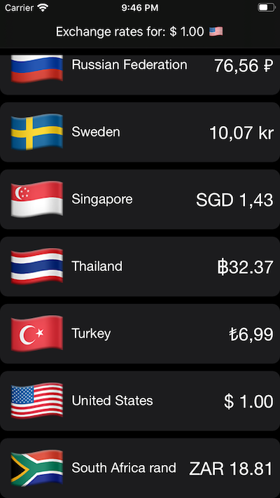
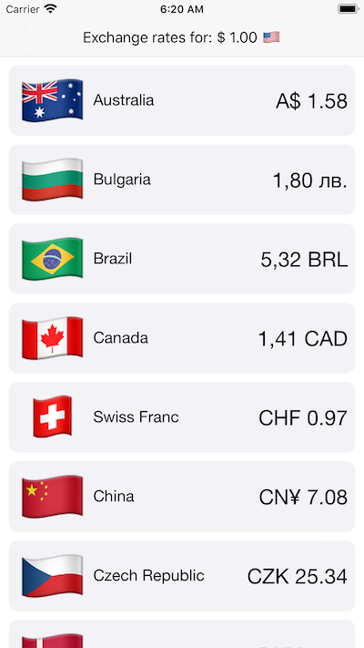

# Currency Converter

Currency Converter is an iOS app that shows the current conversion rates for the selected currency.

       

The app was written using Xcode 11.4 and requires iOS 13+. But the only feature that requires iOS 13 are the background and text colors. So if you want to run on earlier versions just create a new project and change the colors.

## License

Currency Converter is licensed under the MIT License. See the LICENSE file for more information, but basically this is sample code and you can do whatever you want with it.
